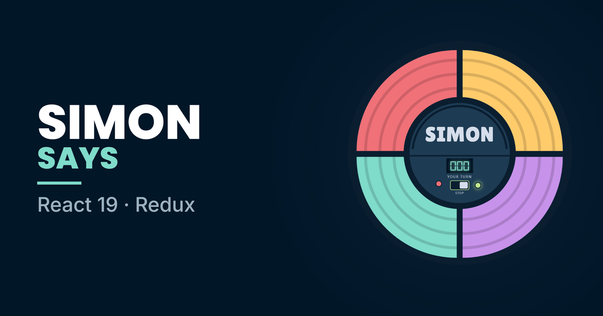

<p align="center">
  
</p>

<h1 align="center">Simon Says</h1>

<p align="center">
  <strong>Watch the sequence, then play it back — one step longer every round.</strong>
</p>

<p align="center">
  <a href="https://dangervalentine.github.io/react-redux-simon-says/">Live Demo</a>
</p>

<p align="center">
  <a href="https://dangervalentine.github.io/react-redux-simon-says/">
    
  </a>
</p>

<p align="center">
  
  
  
  
  
</p>

---

A web rendition of Hasbro's Simon. The console plays a sequence of tones, you play it back, and it gets one step longer every time you get it right. The whole unit is drawn in CSS — the four pads are radial-gradient quadrants of a circle, not images — with the game state in a plain Redux store.

## Playing

Flip the switch to start. The board replays the sequence, the readout tells you whose turn it is, and a wrong pad ends the run.

| Control | Does |
|---------|------|
| **Switch** | Starts a game. Flip it again mid-game to stop and reset. |
| **Pads** | Repeat the sequence back. Only live on your turn. |
| **Wordmark** | Cycles the pad colour scheme. Unlabelled on purpose — hover it. |
| **Red button** | The same thing, for anyone who pokes at the console instead. |

The readout carries a running status — `PRESS START`, `WATCH`, `YOUR TURN`, `GAME OVER` — because a board that has gone quiet while it replays otherwise looks identical to one that has stopped responding.

## Theming

Every colour in the app — pads, console and chrome alike — resolves through [`src/theme.js`](./src/theme.js), which holds the **Night Owl** dark palette.

`colors` is the raw token tree, copied verbatim from the shared design tokens so it stays diffable against its source. `ui` names those tokens for what they paint (`bezel`, `screenOn`, `lightDim`, …), and `applyThemeVars()` flattens the whole thing onto `:root` as CSS custom properties — `--no-*` for raw tokens, `--ui-*` for semantic names and the pre-composited alpha blends plain CSS can't derive. `App.css` reads those; nothing outside `theme.js` hardcodes a colour.

**Pad schemes.** `colorSchemes` holds three sets of four. Every set has to satisfy one hard constraint — four colours a player can tell apart instantly, at a glance, under a flashing overlay — so each spans the hue wheel rather than grouping by temperature. A "cool set" reads nicely as a swatch strip but compresses the hue range, and two pads a shade apart make a worse game. The sets separate on luminance as well as hue, which is what keeps them legible for colour-blind players rather than relying on hue alone.

To retheme, change the tokens. Two assets are generated *from* the running app and need regenerating when the console's look changes: [`public/favicon.svg`](./public/favicon.svg) and `public/simon-says.png` — the og:image and the hero above.

## How It Works

The store is deliberately small and the reducer is pure:

```
switch flipped ──► GAME_START
                     │
                     ▼
              playbackSequence grows by one random pad
                     │
                     ▼
        Container effect: halt input, replay the sequence
        └── each pad lights for PAD_LIT_MS while its tone sounds
                     │
                     ▼
              allow input ──► player presses pads
                     │
                     ▼
              BUTTON_PRESS compares against playbackSequence
                     ├── mismatch ──► lastEvent: 'fail'
                     │                 └── buzz, board desaturates,
                     │                     score holds, then GAME_END
                     └── sequence complete ──► lastEvent: 'round'
                                               └── chime, score++,
                                                   ADD_TO_PLAYBACK_SEQUENCE
```

**Sounds live outside the reducer.** They used to be played from inside it, which made it impure and meant a cue fired at whatever moment the action happened to dispatch — there was no way to sequence audio against an animation. The reducer now records only *that* a round completed or the player slipped, via a `lastEvent` counter; `Container` decides how that looks and sounds.

**Tones are preloaded and pooled.** Each press used to build a fresh `new Audio()` and set `currentTime` on it before it had loaded — a no-op on an unloaded element, so the intended trim never applied, and the first press of each pad waited on a network fetch. Each tone is now loaded once and replayed from a short pool of clones, and it stops when its pad goes dark so the light and the sound describe the same thing.

**Pads expose an imperative handle.** Playback has to light a pad the player hasn't touched, so each `Button` exposes `flash()` through a ref. That's the pattern this project was originally written to demonstrate — it used string refs (`this.refs[i]`), which React 19 removed, so it's a `forwardRef` plus `useImperativeHandle` now. Same idea, current API.

**The entrance is a power-on.** The console settles, the four pads bloom outward from the centre a beat apart, the dial follows and the readout flickers awake — all opacity and transform, so it composites on the GPU. `prefers-reduced-motion` gets the finished console with no movement.

## Quick Start

```bash
npm install
npm run dev        # dev server at http://localhost:3000/
npm run lint       # eslint over src/
npm run build      # production bundle in ./dist
npm run preview    # serve the production bundle locally
```

## Tech Stack

- **React 19** — hooks throughout; no class components
- **Vite 6** — dev server and build
- **Redux 5** + **react-redux 9** — game state in a single plain reducer
- **CSS** — the console is drawn, not pictured
- **Night Owl** — one token module drives every colour

## Project Structure

```
src/
├── main.jsx                     React 19 createRoot entry; installs the theme
├── Container.jsx                Wires the store to the board; owns playback timing
├── theme.js                     Night Owl tokens, pad schemes, CSS var bridge
├── timing.js                    Playback pacing constants
├── audio.js                     Preloaded, pooled tone playback
├── resources.js                 Sound imports
├── App.css                      The entire console, drawn in CSS
├── helpers/index.js             Score formatting, scheme cycling, delay
│
├── actions/control.js           Action creators
├── actiontypes/control.js       Action type constants
├── reducers/control.js          The game reducer (pure)
│
└── components/
    ├── Button.jsx               One pad; exposes flash() to the parent
    ├── Controls.jsx             The centre dial
    ├── ControlButtons.jsx       Lamp, start switch, colour button
    ├── Score.jsx                Seven-segment readout + status line
    └── GithubAttribution.jsx    Corner source link
```

## Deployment

CI is wired up via GitHub Actions:

- [`.github/workflows/ci.yml`](./.github/workflows/ci.yml) — lint + build on every pull request and feature branch push.
- [`.github/workflows/deploy.yml`](./.github/workflows/deploy.yml) — builds and publishes to GitHub Pages on every push to `master`.

The deploy workflow uses the modern `actions/deploy-pages` flow — no `gh-pages` branch, and no build output committed to the repo. One-time setup:

1. **Settings → Pages → Build and deployment → Source:** select **GitHub Actions**.
2. Confirm `master` is allowed under **Settings → Environments → github-pages → Deployment branches and tags**. Step 1 normally adds the default branch automatically, but if the source was previously "Deploy from a branch", the allow-list can still hold only the old publishing branch — in which case the build job passes and only the deploy is refused, with *"Branch master is not allowed to deploy to github-pages due to environment protection rules."*

`base` is `'./'` in [`vite.config.js`](./vite.config.js), so the bundle resolves from the Pages subpath without hardcoding the repo name.

## License

[MIT](./LICENSE)
